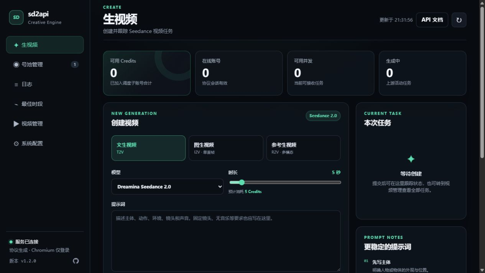
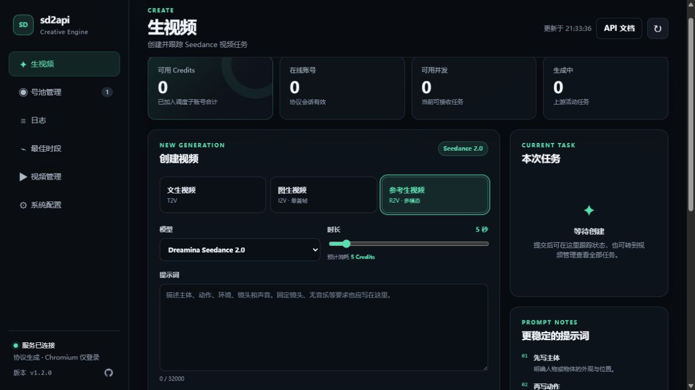
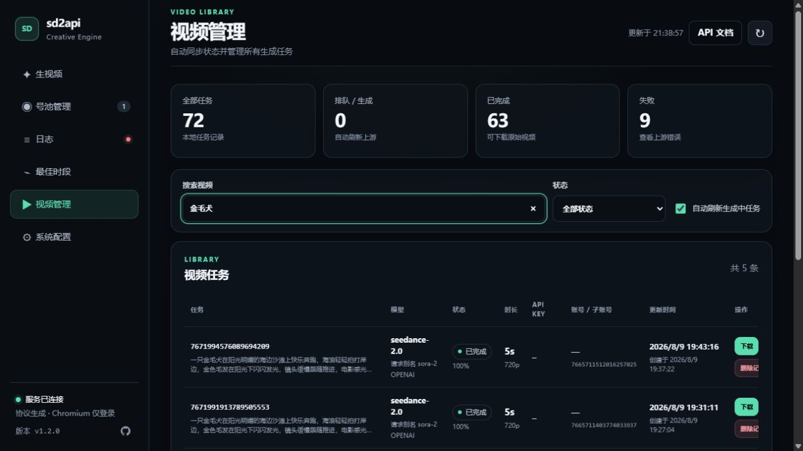
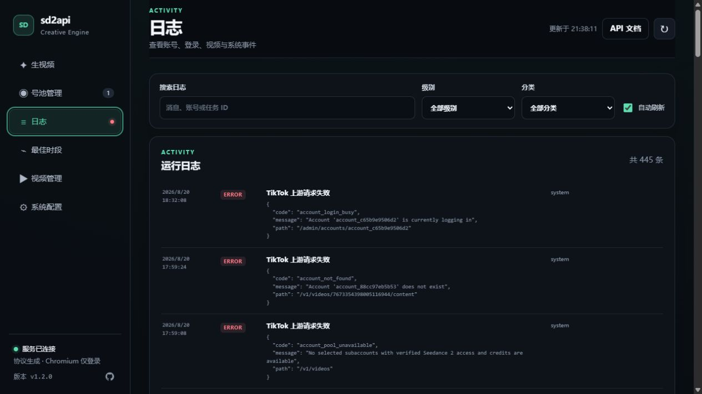
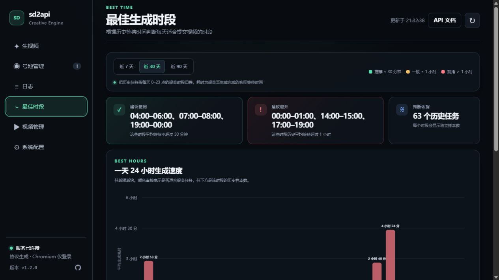
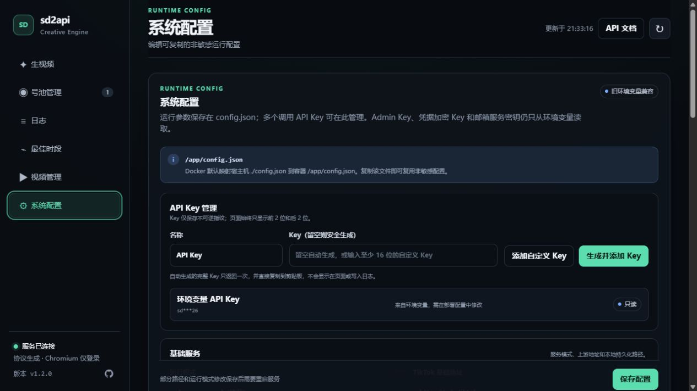
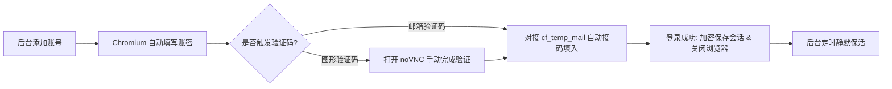

<div align="center">

# sd2api

**TikTok Symphony Creative Studio (Seedance 2.0) 视频生成 API 网关**

提供兼容 **OpenAI Videos API** 与 **Seedance / ModelArk API** 的标准接口，支持文生视频、图生视频与多模态参考生视频。<br>
内置多账号/子账号并发池、协议级调度、自动会话保活、临时邮箱自动接码与现代化 Web 管理控制台。

[](https://www.python.org/)
[](https://fastapi.tiangolo.com/)
[](https://www.docker.com/)
[](LICENSE)

[✨ 特性一览](#-特性一览) • [🚀 快速开始](#-快速开始) • [📖 API 调用示例](#-api-调用示例) • [🖥️ 管理控制台](#-web-管理控制台) • [⚙️ 配置说明](#-配置说明) • [📊 参数与状态映射](#-参数与状态映射)

</div>

---

> [!TIP]
> **💡 Seedance 2.0 权限与广告金获取**：
> TikTok 官方通常要求 Ads 账户在过去 30 天内累计广告花费满 $5,000 才会开放 Seedance 2 权限。如果有投放计划，可通过 **[ttoh.app](https://ttoh.app)** 实时查询最新的广告金活动、优惠券与开户资格，有效降低获取权限的实际门槛与成本。

---

## ✨ 特性一览

- 🎯 **双重 API 兼容**
  - **OpenAI Videos 规范** (`/v1/videos`)：原生兼容 OpenAI 官方 Python SDK，无缝对接各类 AI 聚合网关及上层应用。
  - **Seedance / ModelArk 规范** (`/api/v3/contents/generations/tasks`)：兼容火山引擎/字节 Seedance 接口风格。
- 🎬 **全模态视频生成能力**
  - **文生视频 (T2V)**：支持 4～15 秒时长指定与自由文本提示词。
  - **图生视频 (I2V)**：支持首帧图片输入（支持远程 URL、Base64 Data URL 或 Multipart 上传）。
  - **多模态参考生视频 (R2V)**：支持混合参考输入（最多 9 张图片 + 3 个视频 + 3 段音频）。
- ⚡ **高性能协议直连**
  - 采用 Chrome TLS / HTTP2 指纹协议直连，仅在登录及定时保活时按需启动 Chromium，正常生成不依赖浏览器 DOM，并发更高、内存占用极低。
- 🏢 **多账号 & 子账号智能池**
  - 自动发现主账号下的全部 Client / Partner 子账号与 Seedance 2.0 权限。
  - 支持多子账号并发调度，每个子账号独立 CookieJar 隔离。
  - 智能负载均衡调度，支持上游每日额度（Quota Limit）自动熔断降级。
- 🔄 **全自动化无人值守运维**
  - **自动接码**：对接 [coolqoo/cf_temp_mail](https://github.com/coolqoo/cf_temp_mail)（或兼容该 API 标准的临时邮箱服务）实现登录邮件验证码全自动提取。
  - **自动保活**：定时静默会话保活并自动刷新加密协议凭证。
  - **noVNC 极简交互**：内置 noVNC，遇到图形验证码时可通过 Web 界面轻松完成手动验证。
- 🖥️ **现代化 Admin WebUI**
  - 提供视频在线生成与调试、号池状态实时监控、任务检索与原始 MP4 下载、日志检索及系统配置管理。

---

## 🚀 快速开始

### 方式 1：Docker Compose 部署（推荐）

1. **克隆项目并准备配置文件**：

   ```bash
   git clone https://github.com/usdfan/sd2api.git
   cd sd2api
   cp .env.docker.example .env.docker
   cp config.example.json config.json
   ```

2. **配置环境变量 (`.env.docker`)**：

   ```dotenv
   SD2API_API_KEY=your-custom-api-key          # 调用生视频 API 的密钥
   SD2API_ADMIN_KEY=your-custom-admin-key      # 访问 Web 管理后台的密钥
   SD2API_CREDENTIAL_KEY=                      # 凭据加密密钥（留空则自动生成）
   NOVNC_PASSWORD=your-novnc-password          # noVNC 访问密码
   SD2API_TEMP_MAIL_BASE_URL=                  # [可选] cf_temp_mail 邮件服务地址 (https://github.com/coolqoo/cf_temp_mail)
   SD2API_TEMP_MAIL_API_KEY=                   # [可选] cf_temp_mail 的 API_SECRET
   ```

3. **启动服务**：

   ```bash
   docker compose up -d
   ```

4. **访问服务**：
   - **Web 管理控制台**：`http://127.0.0.1:8765/admin`（使用 `SD2API_ADMIN_KEY` 登录）
   - **noVNC 远程桌面**：`http://127.0.0.1:6080/vnc.html?autoconnect=1&resize=scale`
   - **Swagger API 文档**：`http://127.0.0.1:8765/docs`

5. **添加账号与首次登录**：
   - 进入 Web 控制台（`/admin`）的 **号池管理** 页面，添加 TikTok Ads 登录邮箱与密码。
   - 连接 **noVNC 远程桌面**（端口 `6080`，输入 `NOVNC_PASSWORD`），在弹出的浏览器窗口中**手动完成图形滑块/点选打码**。
   - 打码完成后系统会自动完成邮箱接码并加密保存会话；在号池中为具有 Seedance 权限的子账号开启 **加入调度** 开关即可开始调用 API。

> [!NOTE]
> 如果部署在远程 VPS 上且未配置反向代理，可以通过 SSH 隧道将端口映射到本地访问：
> ```bash
> ssh -L 8765:127.0.0.1:8765 -L 6080:127.0.0.1:6080 user@your-vps-ip
> ```

---

### 方式 2：本地源码运行

```bash
# 1. 创建并激活虚拟环境
python -m venv .venv
# Windows:
.\.venv\Scripts\Activate.ps1
# Linux/macOS:
source .venv/bin/activate

# 2. 安装依赖
pip install -e ".[test]"
playwright install chromium

# 3. 初始化配置
cp .env.example .env
cp config.example.json config.json

# 4. 启动服务
uvicorn sd2api.main:app --host 127.0.0.1 --port 8765
```

---

## 📖 API 调用示例

### 1. OpenAI 兼容接口 (`/v1/videos`)

#### Python SDK 调用

```python
from openai import OpenAI

client = OpenAI(
    api_key="your-custom-api-key",
    base_url="http://127.0.0.1:8765/v1",
)

# 1. 创建文生视频任务
video = client.videos.create(
    model="sora-2",  # 或 seedance-2.0
    prompt="A red ball rolling slowly on a clean white tabletop, static camera.",
    seconds="5",  # 支持 4-15 秒
)
print(f"Task ID: {video.id}, Status: {video.status}")

# 2. 查询任务状态
status = client.videos.retrieve(video.id)
print(f"Current Status: {status.status}")
```

#### cURL 调用示例

##### 文生视频 (T2V)

```bash
curl -X POST http://127.0.0.1:8765/v1/videos \
  -H "Authorization: Bearer your-custom-api-key" \
  -H "Content-Type: application/json" \
  -d '{
    "model": "sora-2",
    "prompt": "一颗红球在白色桌面上缓慢滚动，固定镜头",
    "seconds": 5
  }'
```

##### 图生视频 (I2V - Multipart 上传)

```bash
curl -X POST http://127.0.0.1:8765/v1/videos \
  -H "Authorization: Bearer your-custom-api-key" \
  -F "model=sora-2" \
  -F "prompt=让小猫转头看向镜头" \
  -F "seconds=5" \
  -F "input_reference=@./cat.png;type=image/png"
```

##### 多模态参考生视频 (R2V - Reference to Video)

```bash
curl -X POST http://127.0.0.1:8765/v1/videos \
  -H "Authorization: Bearer your-custom-api-key" \
  -F "model=sora-2" \
  -F "prompt=以图1与图2为角色主体，参考视频1的动作运镜，并匹配音频1的节奏" \
  -F "seconds=5" \
  -F "reference_media=@./char1.png;type=image/png" \
  -F "reference_media=@./char2.png;type=image/png" \
  -F "reference_media=@./motion.mp4;type=video/mp4" \
  -F "reference_media=@./bgm.mp3;type=audio/mpeg"
```

##### 状态查询与视频下载

```bash
# 查询任务状态
curl http://127.0.0.1:8765/v1/videos/{video_id} \
  -H "Authorization: Bearer your-custom-api-key"

# 下载原始 MP4 视频
curl http://127.0.0.1:8765/v1/videos/{video_id}/content \
  -H "Authorization: Bearer your-custom-api-key" \
  -o result.mp4
```

---

### 2. Seedance / ModelArk 风格接口 (`/api/v3/contents/generations/tasks`)

#### 创建任务 (JSON)

```bash
curl -X POST http://127.0.0.1:8765/api/v3/contents/generations/tasks \
  -H "Authorization: Bearer your-custom-api-key" \
  -H "Content-Type: application/json" \
  -d '{
    "model": "seedance-2.0",
    "content": [
      {
        "type": "text",
        "text": "以图1与图2为主角，参考视频1动作"
      },
      {
        "type": "image_url",
        "image_url": { "url": "https://example.com/character1.png" },
        "role": "reference_image"
      },
      {
        "type": "image_url",
        "image_url": { "url": "https://example.com/character2.png" },
        "role": "reference_image"
      },
      {
        "type": "video_url",
        "video_url": { "url": "https://example.com/dance.mp4" },
        "role": "reference_video"
      }
    ],
    "duration": 5
  }'
```

#### 查询任务

```bash
curl http://127.0.0.1:8765/api/v3/contents/generations/tasks/{task_id} \
  -H "Authorization: Bearer your-custom-api-key"
```

---

## 🖥️ Web 管理控制台

打开浏览器访问 `http://127.0.0.1:8765/admin` 并输入 `SD2API_ADMIN_KEY`：

| 功能模块 | 说明 |
|---|---|
| 🎬 **生视频** | 提供可视化的 T2V、单图 I2V、多模态 R2V 任务创建面板，实时查看可用额度与任务状态 |
| 🏢 **号池管理** | 添加 TikTok Ads 账号、执行登录/登出、扫描 Client/Partner 子账号并勾选加入调度池 |
| 📊 **视频管理** | 统一管理所有视频任务，支持按状态筛选、自动刷新上游生成进度、预览与下载原始 MP4 |
| 📝 **系统日志** | 实时查看系统运行、账号登录、会话保活与视频生成的结构化持久日志 |
| ⚙️ **系统配置** | 在线调整账号池并发限制、任务等待超时、保活周期等运行参数 |

### 控制台预览

<table>
  <tr>
    <td width="50%" align="center">
      <strong>文生视频</strong><br>
      
    </td>
    <td width="50%" align="center">
      <strong>多模态参考生视频</strong><br>
      
    </td>
  </tr>
  <tr>
    <td width="50%" align="center">
      <strong>视频管理</strong><br>
      
    </td>
    <td width="50%" align="center">
      <strong>运行日志</strong><br>
      
    </td>
  </tr>
  <tr>
    <td width="50%" align="center">
      <strong>最佳生成时段</strong><br>
      
    </td>
    <td width="50%" align="center">
      <strong>系统配置</strong><br>
      
    </td>
  </tr>
</table>

### 账号登录与验证流程



1. **添加账号**：在号池管理面板输入 TikTok Ads 登录邮箱与密码（密码经 Fernet 加密后写入 SQLite，不会明文泄露）。
2. **自动接码**：配置 `SD2API_TEMP_MAIL_BASE_URL` 后，程序自动对接 [coolqoo/cf_temp_mail](https://github.com/coolqoo/cf_temp_mail) 标准 API（调用 `GET /api/emails?to_address=...`）轮询并填入邮件验证码。
3. **图形验证码处理 (noVNC)**：若遇到 TikTok 图形滑块或点选验证，系统将标记为 `captcha_required`。管理员只需打开 noVNC 远程桌面（默认端口 `6080`，输入 `NOVNC_PASSWORD` 登录），在弹出的浏览器窗口中**手动拖动滑块/点击完成验证**，系统将自动接管后续流程并关闭 Chromium。
4. **子账号发现与启用**：登录成功后自动获取全部 Client / Partner 子账号与 Seedance 权限，管理员在面板中为可用子账号开启“加入调度”即可。

---

## 📊 参数与状态映射

### 1. 生成参数说明

| 功能 | Seedance 字段 | OpenAI 字段 | 说明 |
|---|---|---|---|
| **模型** | `model` | `model` | 支持 `seedance-2.0`（实测支持）与兼容别名 `sora-2` |
| **时长** | `duration` | `seconds` | **生效**。支持 `4`～`15` 的任意整数（秒），TikTok 消耗点数等于生成秒数 |
| **首帧图** | `role=first_frame` | `input_reference` | **生效**。单张首帧图片用于图生视频 |
| **多素材参考** | `content` 数组 | `reference_media` / `references` | **生效**。支持最多 9 张图片、3 个视频、3 段音频混合输入 |
| **分辨率/画幅** | `resolution` / `ratio` | `size` | 兼容性字段。TikTok 网页端固定输出 720p 竖屏视频（`720x1280`） |
| **水印控制** | `watermark` | - | 兼容性字段。程序默认自动下载无水印原始高清视频（Original VID） |

### 2. 任务状态映射

| TikTok 状态 | Seedance 响应状态 | OpenAI 响应状态 | 说明 |
|---|---|---|---|
| 等待排队中 | `queued` | `queued` | 任务已提交，等待上游分配 GPU 算力 |
| 生成 / 渲染中 | `running` | `in_progress` | TikTok 正在生成与渲染视频片段 |
| 生成成功 | `succeeded` | `completed` | 视频生成完毕，已获取原始视频下载 URL |
| 生成失败 | `failed` | `failed` | 上游生成失败或超出重试限制 |

---

## ⚙️ 配置说明

### 环境变量 (`.env.docker` / `.env`)

| 环境变量 | 必填 | 默认值 | 说明 |
|---|---|---|---|
| `SD2API_API_KEY` | 否 | `change-me` | 调用 `/v1/videos` 与 `/api/v3/...` 视频生成接口的 Bearer 密钥 |
| `SD2API_ADMIN_KEY` | 否 | `change-me-admin` | 访问 `/admin` Web 控制台与管理接口的管理员密钥 |
| `SD2API_CREDENTIAL_KEY` | 否 | 随机生成 | 用于加解密保存到 SQLite 的账号凭证密钥 |
| `NOVNC_PASSWORD` | 否 | `change-me-vnc` | Docker 容器中 noVNC 远程桌面的登录密码 |
| `SD2API_TEMP_MAIL_BASE_URL` | 否 | - | [coolqoo/cf_temp_mail](https://github.com/coolqoo/cf_temp_mail) 服务地址（支持该 API 标准的任意临时邮箱），用于自动读取验证码 |
| `SD2API_TEMP_MAIL_API_KEY` | 否 | - | `cf_temp_mail` 服务的 `API_SECRET` |

### 运行配置 (`config.json`)

系统主要运行参数保存在 `config.json`，也可在 Web 控制台的“系统配置”页面在线修改：

| 配置项 | 默认值 | 说明 |
|---|---|---|
| `mode` | `browser_pool` | 运行模式，推荐保持 `browser_pool`（纯协议调度 + 按需浏览器登录） |
| `pool_subaccount_concurrency` | `5` | 单个子账号允许同时并发进行的最大任务数 |
| `pool_quota_cooldown` | `86400` | 子账号触发每日上限（Quota Limit）后的熔断冷却时间（秒） |
| `session_keepalive_interval` | `21600` | 会话自动保活周期（默认 6 小时） |
| `novnc_public_port` | `6080` | 管理端“打开 noVNC”按钮使用的公网端口；端口映射不同时需同步修改 |
| `request_timeout` | `60.0` | 上游 HTTP 请求超时时间（秒） |
| `upload_max_bytes` | `209715200` | 素材上传最大文件限制（200MB） |

---

## 🛠️ 本地测试

项目包含完整的单元测试，均使用 Mock 上游接口，不会消耗实际 TikTok 点数：

```bash
pytest
```

---

## 📌 Roadmap

- [x] 多子账号并发调度与槽位管理
- [x] 上游单日额度（Quota Limit）自动熔断与换号重试
- [x] 定时无感会话保活与会话凭证加密存储
- [x] 临时邮箱自动接码与 noVNC 图形打码支持
- [x] 多 API Key 授权管理支持
- [ ] 账号掉线、需人工打码等异常事件 Webhook 通知（Telegram / 企业微信 / 飞书）

---

## ⚠️ 免责声明

1. 本项目为开源的非官方逆向适配器，仅供个人学习、技术研究与自动化测试使用。
2. 请仅将本项目应用于您拥有合法访问权限的 TikTok Ads 账户，并严格遵守 TikTok 的相关服务条款与法律法规。
3. 作者不对因使用本项目导致的任何账户受限、封禁或数据丢失承担责任。
4. `sora-2` 仅为兼容 OpenAI SDK 的模型别名，底层实际调用的是账号内的 Dreamina Seedance 2.0 模型。

---

## 🙏 Acknowledgments

Thanks to the [linux.do](https://linux.do) community for the support.

---

## 📄 开源许可

本项目遵循 [CC BY-NC 4.0](LICENSE)（知识共享署名-非商业性使用 4.0 国际许可协议）开源：

- ✅ **允许**：个人免费学习、研究、代码修改及非营利性自用部署。
- ❌ **禁止**：严禁将本项目、其衍生版本或基于本项目搭建的任何服务用于任何**商业盈利、转售、分发收费 API** 等商业化运营行为。
